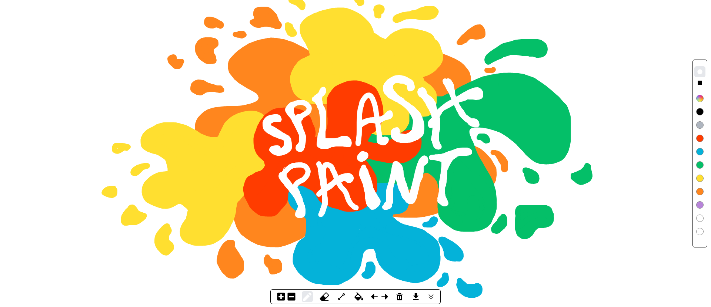

<!-- # Splash Paint -->

<h1 align="center">Splash Paint</h1>

<p align="center">


</p>



Splash Paint is a lightweight, React-based drawing application offering a modern take on Microsoft Paint., it was designed for simplicity and to give you full control over your creative flow.

---

##  Why Build Splash Paint?
- **Nostalgic yet modern**: I created this project because a loved microsoft paint when i was a kid, so i wanted to create a mordernized version of it, easier to use, being able to undo more than three actions and increase the pencil size as much i want

- **A good challenge**: i wanted to challenge myself and create a hybrid project that uses react for the UI and pure TypeScript for the drawing logic to see if i could connect both parts together later. it was hard but worth it.

---

##  Key Features

- **Drawing Tool (Pencil)**  
  Smooth, performant strokes with fully customizable size. Choose between **rounded** or **squared** brush stroke.

- **Eraser**  
  Adjustable size and style—same flexibility as the pencil tool.

- **Basic Shapes**  
  Effortlessly draw lines, squares, circles, and triangles with precise borders.

- **Fill Bucket**  
  Quickly fill closed areas using any color you like.

- **Undo / Redo**  
  Reverse or restore up to **20 actions** with ease.

- **Download Your Drawing**  
  Export your masterpiece in **PNG format** with a click.

- **Color Palette**  
  Offers a selection of preset colors plus a custom color picker.

- **Clear Canvas (Trash)**  
  Start fresh anytime with a full canvas reset.


##  Tech Stack

- **Framework**: React  
- **Language**: TypeScript  
- **State Management**: Redux  
- **Rendering**: HTML5 Canvas  
- **Bundler / Dev Server**: Vite  
- **Styling**: Tailwind CSS  
- **Linting**: ESLint (configured via `eslint.config.js`)  
- **Build Configs**: `tsconfig`, `vite.config.ts`, and Tailwind/TSC presets


##  Getting Started

### Prerequisites

- [Node.js](https://nodejs.org/) (version 14 or newer)  
- A modern web browser (supports HTML5 Canvas)

1. **Clone the repo**  
   ```bash
   git clone https://github.com/creativeplot/Splash-Paint.git
   cd Splash-Paint

2. **Install dependencies**
   ```bash
   npm install
   # or
   yarn install

3. **Run the development server**
   ```bash
   npm run dev
   # or
   yarn dev

The app will be accessible at http://localhost:5173/ (or another port Vite assigns).

4. **Build for production**
   ```bash
   npm run build
   # or
   yarn build

Production-ready files will be output to the dist/ folder.

---


##  Contribution Guide
Check out the [Contributing Guide](CONTRIBUTING.md) for full details on how to get involved.

## License

This project is available under the MIT License. Check out the LICENSE
 file for full details.


## About the Author

Built by Victor Souza. If you’re nostalgic about Microsoft Paint and enjoy modern, lightweight web apps—this is for you.