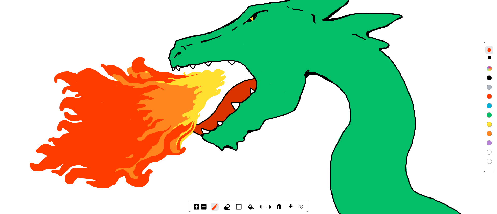

# 🫟 Splash Paint

A paint app for you to draw whatever is in your mind, designed to be easy and enjoyable to use.

### Reasons behind the project

I created this project because a loved microsoft paint when i was a kid, so i wanted to create a mordernized version of it, easier to use, being able to undo more than three actions and increase the pencil size as much i want

Another reason is that i wanted to challenge myself and create a hybrid project that uses react for the UI and pure TypeScript for the drawing logic to see if i could connect both parts together later. it was hard but worth it.

### What the app can do
Splash Paint was designed with drawing freedom in mind, altough its features are simple you can draw pretty much anything with it.

### Main Features

Splash Paint was designed with drawing freedom in mind, altough its features are simple you can draw pretty much anything with it.

pencil: you can increase or decrease its size as much as you like, it has smooth stroke while mainting a good performance and it comes with two modes of stroke, rounded and squared for you to choose from

eraser: you can increase or decrease the eraser size and you can change its stroke style as well

shapes: it comes with a set of basic shapes, line, square, circle and triangle with well defined borders.

fill bucket: a fill tool to cover closed areas with any color you like.

undo/redo : allows you to undo/redo up to 20 actions

download: Allows you to download you drawing in a png format.

color pallete: a set of predefined colors together with a custom color option.

trash: clean the canvas completely

### Getting Started
This is an example of how you may give instructions on setting up your project locally. To get a local copy up and running follow these steps.
